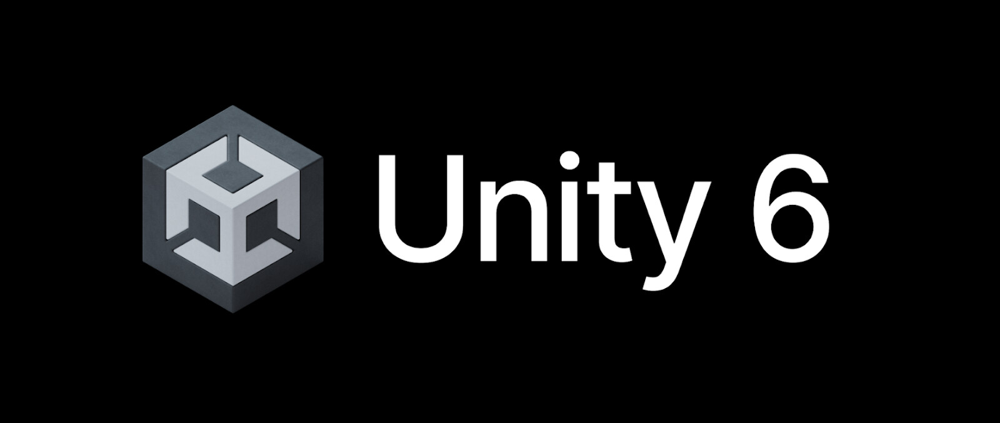

# 📁 Estructura del Proyecto

Este documento describe la estructura y organización del proyecto para facilitar su comprensión, mantenimiento y escalabilidad.

---

## 📑 Índice

1. [Arquitectura](#arquitectura)
2. [Tecnologías utilizadas](#tecnologías-utilizadas)
   - [Motor Grafico](#motor-grafico)
   - [Lenguajes/](#lenguajes)
3. [Carpetas](#carpetas)
   - [Docs/](#docs)
   - [Proyecto-Unity/](#proyecto-unity)

---

## Arquitectura

Consulta el archivo [`Arquitectura.md`](./Arquitectura.md) para una descripción detallada del diseño del proyecto.

---

## Tecnologías utilizadas

### Motor Grafico/

Para este videojuego utilizamos el motor grafico **Unity 6**


### Lenguajes/

Usamos exclusivamente **C#** para toda la lógica del juego en Unity.

| Extensión | Lenguaje | Uso                          |
|-----------|----------|-------------------------------|
| `.cs`     | C#       | Toda la lógica del juego      |

---

## Carpetas

### Docs/

Consulta el archivo [`Analisis De Requerimiento PREVIEW`](./Markdown_AnalisisReq_Preview.md) para una descripción previa de los requerimientos del proyecto, dentro de este hay un hipervinculo para el proyecto completo.


### Proyecto-Unity/

Contiene todas las carpetas necesarias para abrir y ejecutar el proyecto correctamente desde Unity Hub.

```text
Assets/                  # Código fuente, escenas, prefabs, materiales, modelos, sonidos, animaciones, etc.
├── Adaptive Performance/ # Configuraciones para optimización de rendimiento (mobile/VR)
├── Audio/                # Efectos de sonido y música
├── Editor/               # Scripts personalizados para herramientas del editor
├── Prefabs/              # Objetos preconfigurados del juego
├── Recursos/             # Assets cargados dinámicamente por scripts
├── Scenes/               # Escenas del juego
├── Scripts/              # Código fuente organizado por funcionalidad
│   ├── Camara/           # Control de la cámara y su comportamiento (movimiento, seguimiento)
│   ├── Caneca/           # Lógica asociada a las canecas de reciclaje (detección, validación, interacción)
│   ├── Enums/            # Enumeraciones globales del juego
│   ├── Estructuras/      # Clases de datos o estructuras auxiliares
│   ├── GameManager/      # Controlador general (gestión de estados, referencias globales)
│   ├── Interfaces/       # Interfaces para desacoplar sistemas (IItem, IInteractuable, etc.)
│   ├── Items/            # Lógica y definiciones de los objetos recolectables o interactuables
│   ├── Modulo/           # Módulos específicos del juego (ej: ModuloSeparacion, ModuloCompra, ModuloCrafteo)
│   ├── Recicladora/      # Lógica del NPC de la recicladora (animaciones)
│   └── UI/               # Scripts para la interfaz de usuario (menus, HUD, notificaciones)
├── Settings/             # Configuraciones personalizadas (puede incluir sistemas de entrada o settings de paquetes)
└── TextMesh Pro/         # Archivos y recursos del paquete TextMesh Pro para fuentes y texto

Packages/                # Registra los paque
ProjectSettings/         # Configuraciones del proyecto: Input, Tags, Layers, Build Settings, Quality, etc.
UserSettings/            # Configuración específica del usuario 
